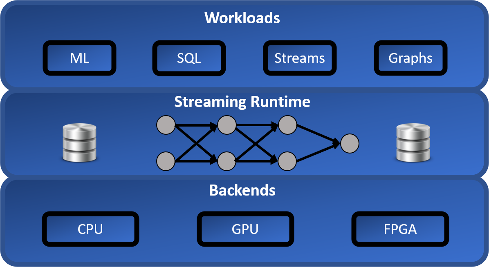

<p align="center">
  
</p>

# Arcon

A runtime for writing real-time analytics applications in the Rust programming language.


[](https://github.com/cda-group/arcon)

#### Project Status

Arcon is in development and should be considered experimental until further notice.

#### Rust Version

Arcon builds against the latest stable release and the current MSRV is 1.53.0.

### Roadmap

See the roadmap [here](https://github.com/cda-group/arcon/projects/1)

## Highlights

*   Arrow-native
*   Hybrid Row(Protobuf) / Columnar (Arrow) System
*   Dynamic & Scalable [Middleware](https://github.com/kompics/kompact)
*   Flexible State Management
    *   Backend per Operator (e.g., RocksDB, Sled)
    *   Eager and Lazy state indexes

## Vision

<p align="center">
  
</p>

## Example

```rust,no_run
use arcon::prelude::*;

fn main() {
    let mut app = Application::default()
        .iterator(0u64..100, |conf| {
            conf.set_arcon_time(ArconTime::Event);
            conf.set_timestamp_extractor(|x: &u64| *x);
        })
        .filter(|x| *x > 50)
        .to_console()
        .build();

    app.start();
    app.await_termination();
}
```

More examples can be found [here](examples).

## Project Layout

* [`arcon`]: Arcon crate
* [`arcon_build`]: Protobuf builder
* [`arcon_macros`]: Arcon derive macros.
* [`arcon_tests`]: Integration tests
* [`examples`]: Example applications
* [`website`]: Project website

[`arcon`]: arcon
[`arcon_build`]: arcon_build
[`arcon_macros`]: arcon_macros
[`arcon_tests`]: arcon_tests
[`examples`]: examples
[`website`]: website

## Acknowledgements

Arcon is influenced by many great projects whether it is implementation, code practices or project structure:

- [Tokio](https://github.com/tokio-rs/tokio)
- [Datafusion](https://github.com/apache/arrow-datafusion)
- [Apache Flink](https://github.com/apache/flink)
- [Sled](https://github.com/spacejam/sled)

## License

This project is licensed under the [Apache-2.0 license](LICENSE).

## Contribution

Unless you explicitly state otherwise, any contribution intentionally submitted for inclusion in Arcon by you shall be licensed as Apache-2.0, without any additional terms or conditions.