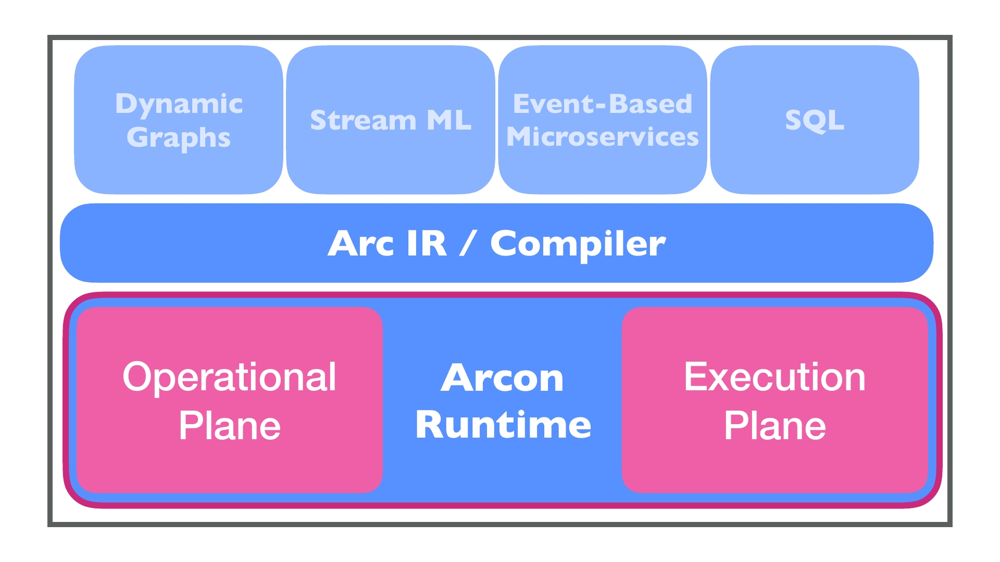

# Arcon

Arcon is a data programming system for building continuous analytic applications. The system is made up of two parts: (1) [Arc](https://cda-group.github.io/papers/Arc_DBPL_2019.pdf), an IR for batch and stream programming;
2) the Arcon runtime, a distributed dataflow runtime that executes applications constructed through Arc.

**Note**: The project is still in an early development stage.

  

## Project Layout

* [`execution-plane`]: The execution plane provides a Rust-based distributed dataflow runtime that executes Arcon applications.
* [`operational-plane`]: The operational plane is responsible for the coordination of the distributed execution of an Arcon application.

[`execution-plane`]: execution-plane
[`operational-plane`]: operational-plane
