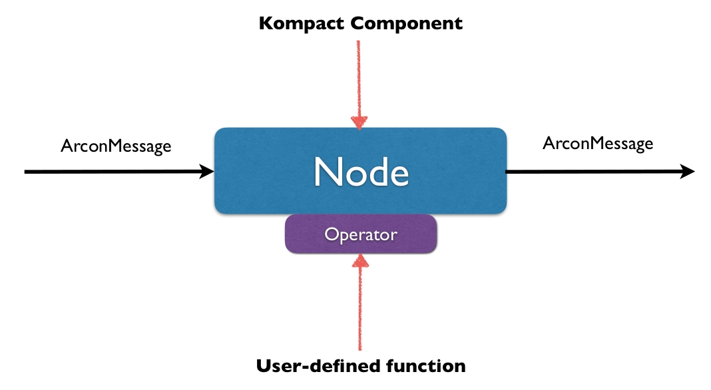
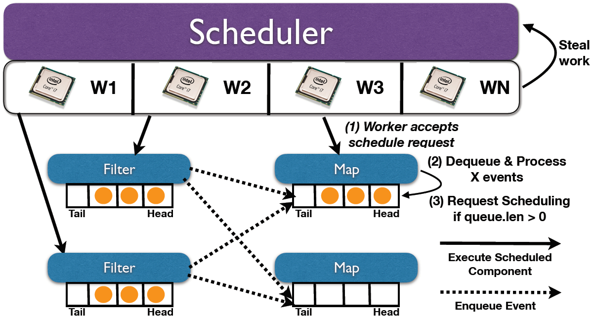

# Runtime

At the core of Arcon is the hybrid component + actor model framework [Kompact](https://github.com/kompics/kompact).
Arcon does not use dedicated threads, but rather relies on the work-stealing scheduler of Kompact to drive the execution of a streaming application.

A Node is a Kompact component that drives the execution a user-defined Arcon [Operator](operators.md). 
An Operator may either be stateless or stateful. More on how state is handled is discussed in
[State Management](state.md). 

The image below illustrates how Arcon nodes are scheduled by Kompact.

