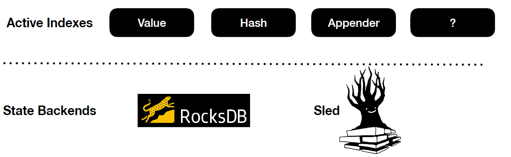

# State Management

In this section, we will cover how Arcon approaches state.

Arcon makes a clear separation between active and historical state. Active state is maintained in in-memory indexes, while cold state is pushed down to a durable state backend. Other streaming systems commonly operate directly on the latter (e.g., RocksDB). This has several drawbacks. Typically the state backends are general-purpose key-value stores and are thus not specialised for streaming workloads. 
The state access pattern is not considered at all. Secondly, state calls have to serialise/deserialise for each operation.

Similarly to other streaming systems, Arcon operates on epoch boundaries. 
Therefore it is only necessary to persist modified state prior to running the epoch snapshotting protocol. 
Deserialisation in Protobuf (Arcon’s data format) compared to serialisation is costly.
Which is why Arcon favours serialisation overhead over its deserialisation counterpart and thus state in Arcon is lazy by default.

As implementing a custom state backend specialised for streaming would require a huge engineering effort, Arcon adds the
**Active State** layer above existing state backends (See image below). The idea is to use the state backends for what they are good at, that is,
storing state efficiently on disk and checkpointing.



However, for some workloads it may make sense to directly use the underlying state backend. 
Arcon provides an **eager** version of all active state indexes. So for example,
`Map` is by default lazy while `EagerMap` operates directly on the state backend. If your map workload is
mostly writes and not much reads, then using the latter would be more suitable.


Arcon enables users to configure different state backends for different stages of the dataflow graph. For write-heavy workloads,
users may want to use `RocksDB` (LSM) as the state backend. Whereas for read-heavy workloads, `Sled` may be a better fit.

## Declaring Arcon State

State in Arcon must implement the trait `ArconState`. The simpliest way 
to acheive this is to use the provided derive macro.

Let's say that we would want to store our `Event` records
in an `Appender` index.

```rust,edition2018,no_run,noplaypen
{{#rustdoc_include ../../examples/src/bin/stateful.rs:data}}
```

We then create our custom state object `MyState` and add the
state indexes as fields. Do note that the `ArconState` derive macro
will require each field to be an Arcon implemented index. However if you
want to access some non-durable field, then you may add the `#[ephemeral]` flag
above the field.

```rust,edition2018,no_run,noplaypen
{{#rustdoc_include ../../examples/src/bin/stateful.rs:state}}
```

Examples of more state indexes can be found [here](../pipeline/indexes.md).
